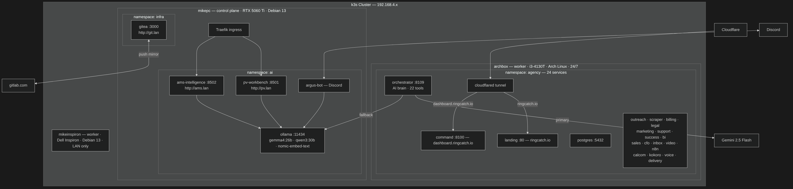

# homelab-infra

Infrastructure as Code for a three-node k3s homelab running a local clinical AI platform and a 24-service AI agency stack.

**k3s v1.36.2** - single control plane on mikepc, two workers (debianbox + centosbook), all on LAN 192.168.4.x. All manifests in `k8s/`. kubectl runs from mikepc only.

---

## Cluster Architecture




---

## Nodes

| Node | Role | LAN IP | Tailscale IP | Hardware | OS |
|---|---|---|---|---|---|
| **mikepc** | Control plane | 192.168.4.54 | 100.97.45.57 | RTX 5060 Ti 16 GB, 32 GB RAM | Debian 13 |
| **debianbox** | Worker | 192.168.4.45 | 100.80.218.77 | Intel i3-4130T, 24/7 | Debian 13 |
| **centosbook** | Worker | 192.168.4.33 | Tailscale (DNS disabled — see gotcha below) | Dell Inspiron 3501 · i5-1035G1 · 8 GB RAM | CentOS Stream 10 |
| **ThinkPad T14 Gen 2** | Daily driver (not a cluster node) | - | Tailscale | i7-1185G7 · 32 GB RAM · 512 GB SSD · WiFi 6 | Debian 13 |

`debianbox` was `archbox` (Arch Linux) on the same hardware until wiped and reinstalled as
Debian 13 on 2026-07-26 after its last Arch update broke reboot reliability — same LAN IP,
new Tailscale IP (old 100.96.122.27 is retired, delete that device from the Tailscale
admin console if still listed). Real k3s node rename: the old `archbox` node object was
deleted and a fresh `debianbox` node joined in its place, not renamed in-place.

`centosbook` is the same physical Inspiron laptop that previously ran Debian 13 as
`mikeinspiron` — reimaged to CentOS Stream 10 and rejoined 2026-07-25. The cluster was
originally deliberately multi-distro (Debian/Arch/CentOS) to catch distro assumptions in
manifests and docs; since the 2026-07-26 rebuild it's Debian/Debian/CentOS instead, so
that property is weaker than designed — see `k3s/README.md` for the full note. Full
setup/gotcha detail (firewalld, Tailscale DNS override) lives in `k3s/SETUP.md`, not here.

kubectl must be run from **mikepc** (control plane). Worker nodes do not have kubectl configured.

---

## k3s Setup

### Installation

```fish
# Control plane (mikepc)
curl -sfL https://get.k3s.io | sh -

# Get node token for workers
sudo cat /var/lib/rancher/k3s/server/node-token

# Workers (debianbox, centosbook) - replace TOKEN
curl -sfL https://get.k3s.io | K3S_URL=https://192.168.4.54:6443 K3S_TOKEN=<token> sh -
```

### kubeconfig

k3s writes the cluster admin config to `/etc/rancher/k3s/k3s.yaml`. Copy to user config and lock down the original:

```fish
mkdir -p ~/.kube
sudo cp /etc/rancher/k3s/k3s.yaml ~/.kube/config
sudo chown mike:mike ~/.kube/config
chmod 600 ~/.kube/config
sudo chmod 600 /etc/rancher/k3s/k3s.yaml

# Add to fish config so kubectl uses the user copy
echo 'set -x KUBECONFIG $HOME/.kube/config' >> ~/.config/fish/config.fish
```

### Storage

k3s ships the **local-path provisioner** as the default StorageClass. PVCs use hostPath storage on the node they're scheduled to - data is local to that node, not replicated.

```
NAME                   PROVISIONER             RECLAIMPOLICY
local-path (default)   rancher.io/local-path   Delete
```

Stateful workloads (Postgres, ChromaDB, Ollama models, Gitea data) all use local-path PVCs pinned to their node via `nodeSelector`.

### Networking

k3s uses **Flannel** (VXLAN) as the CNI and ships **Traefik** as the default ingress controller. All nodes are on the same LAN - no overlay network needed for intra-cluster traffic.

```
Pod CIDR:     10.42.0.0/16
Service CIDR: 10.43.0.0/16
```

LAN DNS for `ai` and `infra` apps - add to `/etc/hosts` on each machine:
```
192.168.4.54  pv.lan ams.lan git.lan
```

### GPU (NVIDIA RTX 5060 Ti on mikepc)

Ollama runs as a GPU pod using the NVIDIA device plugin:

```fish
# Install NVIDIA device plugin
kubectl apply -f https://raw.githubusercontent.com/NVIDIA/k8s-device-plugin/v0.17.0/deployments/static/nvidia-device-plugin.yml

# Verify GPU is visible
kubectl describe node mikepc | grep nvidia
```

The Ollama deployment (`k8s/ollama.yaml`) pins to mikepc and requests the GPU:
```yaml
nodeSelector:
  kubernetes.io/hostname: mikepc
runtimeClassName: nvidia
resources:
  limits:
    nvidia.com/gpu: 1
```

---

## Namespaces

### `ai` - Clinical AI (all pods pinned to mikepc)

| Deployment | Image | Exposed at |
|---|---|---|
| `ollama` | `ollama/ollama:latest` | `http://ollama:11434` (in-cluster) |
| `pv-workbench` | `registry.gitlab.com/molszewski423/pv-workbench:latest` | http://pv.lan |
| `ams-intelligence` | `registry.gitlab.com/molszewski423/ams-intelligence:latest` | http://ams.lan |
| `argus-bot` | `registry.gitlab.com/molszewski423/pv-workbench:latest` | Discord (Argus#1432) |

Ollama models loaded: `gemma4:26b` · `gemma4:e4b` · `qwen3:30b` · `qwen2.5:7b` · `nomic-embed-text`

### `agency` - RingCatch AI Agency (most pods pinned to debianbox; `agency-landing`/`agency-tunnel` on centosbook)

24 services. Custom images are `localhost/agency-*:latest` - built with Podman on debianbox and imported into k3s containerd directly (not in any registry) - **including into each node's own containerd separately** when a pod is scheduled to a node other than debianbox, since there's no shared image registry. `agency-landing` and `agency-tunnel` run on centosbook as the only services with no dependency on the shared, debianbox-pinned `agency-data-pvc` — this means the public site and tunnel stay up independently of debianbox's health. Everything else stays on debianbox until that storage is migrated off local hostPath.

All 17 custom `agency-*` images had to be rebuilt from source on debianbox during the
2026-07-26 archbox→debianbox rebuild, since they only ever existed in the old node's local
containerd. Two build gotchas hit during that rebuild, both now fixed: rootless podman's
`pasta` network backend needs `pasta_options = ["-4"]` in `~/.config/containers/containers.conf`
(IPv6 hangs mid-connection to at least one external registry on this LAN), and any
Containerfile installing `tzdata` via apt needs `ENV DEBIAN_FRONTEND=noninteractive` or the
build hangs forever on an interactive prompt with no TTY to answer it.

See [ringcatch-agency](https://gitlab.com/molszewski423/ringcatch-agency) for the full service list, LLM routing chain, and rebuild workflow.

### `infra` - Self-hosted Git

| Deployment | Exposed at |
|---|---|
| `gitea` | http://git.lan |

Gitea push-mirrors all repos to GitLab on every commit.

---

## Repository Structure

```
k8s/
├── ollama.yaml            # GPU pod + PV + PVC + Service
├── pv-workbench.yaml      # Streamlit app + PVCs (chroma, output)
├── ams-intelligence.yaml  # Streamlit app + PVCs (chroma, output, data)
├── argus.yaml             # Discord bot (same image as pv-workbench)
├── ingress.yaml           # Traefik IngressRoutes: pv.lan, ams.lan, git.lan
├── gitea.yaml             # Gitea + PVC
├── agency.yaml            # All 24 agency Deployments + Services + PVCs
├── tunnel.yaml            # agency-tunnel Deployment + restart/watchdog CronJobs
└── monitoring-values.yaml # kube-prometheus-stack Helm values (debianbox-pinned)

network/
├── adguard/AdGuardHome.yaml   # AdGuard Home config reference (runs natively on debianbox, not in k3s)
├── crowdsec/                  # CrowdSec agent + firewall-bouncer config reference (also native on debianbox)
└── nftables/nftables.conf     # Debian's unused default template — NOT the real config; see Network Security section for why

ansible/
└── archbox.yml, inventory.ini, roles/   # STALE — Arch/pacman-only, not ported to debianbox (Debian/apt); see ansible/README.md

terraform/
├── cloudflare/            # Applied — Cloudflare DNS + tunnel ingress as code
│   ├── main.tf            # DNS records + tunnel config (ringcatch.io, dashboard, cfo, n8n)
│   ├── providers.tf       # Cloudflare provider ~4.0
│   └── variables.tf       # api_token, zone_id, account_id, tunnel_id
└── aws/                   # Ready — apply when AWS account exists
    ├── main.tf            # EC2 + Elastic IP + EBS data volume
    ├── providers.tf       # AWS provider ~5.0
    ├── variables.tf       # Region, instance type, key, home IP, volume sizes
    └── modules/
        ├── ec2/           # Instance, key pair, EIP, EBS, user_data bootstrap
        └── networking/    # Security group: SSH home-only, Tailscale UDP, outbound all
```

Note: `network/adguard/` and `network/crowdsec/` are config references, not k3s manifests —
AdGuard Home and CrowdSec both run as native systemd services on debianbox, not as pods.
`quadlets/` also still exists in this repo (pre-k3s Podman unit files) — kept as historical
reference only; Podman itself has not run as a service on debianbox (or archbox before it)
since 2026-06-14; `podman build` is still used for one-off local image builds.

---

## Operations

### Deploy / update

```fish
# Apply all manifests from mikepc
kubectl apply -f ~/homelab-infra/k8s/

# Restart after image update (ai namespace - pulls from GitLab registry)
kubectl rollout restart deployment/pv-workbench -n ai
kubectl rollout restart deployment/ams-intelligence -n ai

# Agency services - rebuild + reimport on debianbox first, then restart from mikepc
# On debianbox:
cd ~/agency/<service>
podman build -t localhost/agency-<service>:latest .
podman save localhost/agency-<service>:latest | sudo k3s ctr -n k8s.io images import -
# From mikepc:
kubectl rollout restart deployment/agency-<service> -n agency
```

### Cluster health

```fish
kubectl get nodes
kubectl get pods -n ai
kubectl get pods -n agency
kubectl get pods -n infra
kubectl get pvc --all-namespaces
```

### Secrets

```fish
# GitLab registry pull secret (ai namespace - for pulling clinical AI images)
kubectl create secret docker-registry gitlab-registry -n ai \
  --docker-server=registry.gitlab.com \
  --docker-username=<user> \
  --docker-password=<pat-read-registry>

# Agency env (sourced from ~/agency/.env on debianbox - never commit)
kubectl create secret generic agency-env -n agency \
  --from-env-file=/home/mike/agency/.env
```

---


## Network Security

The homelab runs defense-in-depth across four layers: no open inbound ports, DNS filtering, IDS/IPS with automatic firewall enforcement, and Tailscale mesh for inter-node traffic. All layers run on debianbox as the 24/7 perimeter node.

### No Open Inbound Ports

All public traffic enters via **Cloudflare Tunnel** — an outbound-only connection from `agency-tunnel` to Cloudflare's edge. There are no open inbound ports on any machine. The attack surface for public-facing services is zero.

```
Internet → Cloudflare Edge → Cloudflare Tunnel (outbound from centosbook) → k3s services
```

SSH is accessible only from LAN (192.168.4.x) and Tailscale mesh — never exposed publicly.

### CrowdSec (IDS/IPS)

CrowdSec agent + firewall bouncer running on debianbox, integrated with nftables. Reinstalled
fresh during the 2026-07-26 archbox→debianbox rebuild (the old install's local SQLite
machine/bouncer registrations aren't portable across a wipe) — only `config.yaml` and
`notifications/*.yaml` were restored on top of the clean install; API-key credentials are
freshly auto-generated, not restored, since the old ones referenced machine IDs that no
longer exist.

| Component | Detail |
|---|---|
| Agent | Parses logs, detects threats, shares signals with CAPI |
| Firewall bouncer | Enforces bans via nftables rules in real time |
| Community blocklist | 28,850+ IPs blocked from CrowdSec CAPI |
| SSH bans | 32,215 brute-force IPs blocked |
| Collections | `crowdsecurity/linux` · `crowdsecurity/sshd` · `crowdsecurity/auditd` · `crowdsecurity/whitelist-good-actors` |

CrowdSec's community threat intelligence (CAPI) automatically syncs blocklists from global signal sharing — attacks detected on any CrowdSec deployment worldwide feed into the shared blocklist.

### AdGuard Home (DNS Filtering)

Network-level DNS filtering on archbox, serving all LAN clients.

| Setting | Value |
|---|---|
| Listen port | 53 |
| Upstream DNS | Cloudflare DoH (`https://dns.cloudflare.com/dns-query`) · Google DoH (`https://dns.google/dns-query`) · Cloudflare DoT (`tls://1.1.1.1`) |
| Bootstrap | 1.1.1.1 · 8.8.8.8 |
| Filtering | Enabled (blocklists) |
| Safe browsing | Enabled |
| Admin UI | `:3000` (LAN only) |

All DNS queries from LAN machines resolve through AdGuard Home. Upstream queries use DNS-over-HTTPS and DNS-over-TLS — no plaintext DNS leaves the network.

### nftables Firewall

Inter-node k3s traffic (flannel VXLAN, kube-proxy) runs over the **plain LAN**
(192.168.4.x), not Tailscale — migrated off Tailscale-based flannel 2026-06-01 after it
broke on a MikePC IP change (see `k3s/SETUP.md`). Tailscale is kept on all three nodes for
remote administrative access only (SSH from outside the LAN, `tailscale0` accepted below).

**History, for anyone diffing against old docs:** this section used to describe two
separate tables — `inet homelab` (priority -10, general whole-network perimeter firewall,
config at `/etc/nftables-homelab.conf` + `homelab-firewall.service`) layered underneath
`inet ringcatch_firewall` (priority -5, added later, RingCatch/k3s-specific). Comparing
their documented rulesets, the two were functionally near-identical — both default-drop on
INPUT/FORWARD with essentially the same allowlist. During the 2026-07-26 archbox→debianbox
rebuild, `homelab`'s source (never committed to this repo or the backup — it only ever
lived on archbox's disk) was lost, so only `ringcatch_firewall` came back initially. Since
the RingCatch-specific name was misleading for what's actually a whole-host firewall (the
`input`/`forward` hooks apply to all traffic on the box, not just k3s/container traffic —
see [[reference_debianbox]] if that distinction matters to future-you), **the table was
renamed back to `inet homelab` on 2026-07-26** rather than keeping two tables around. There
is now exactly one nftables table doing this job, named `homelab`, not two.

mikepc and debianbox run a default-deny INPUT firewall via the `inet homelab` nftables
table (priority -10, config `/etc/nftables.conf`, standard `nftables.service`; FORWARD and
OUTPUT are explicit `policy accept` — this table only restricts inbound). centosbook has no
equivalent nftables table and relies on `firewalld` alone (see the firewalld gotcha in
`k3s/SETUP.md`) — the "all three nodes" framing in older notes was never quite accurate.
Current live ruleset on debianbox as of 2026-07-26 (rebuilt to match mikepc's structure
after the archbox→debianbox rename, see history note above):

```
INPUT:  policy drop
  - Loopback (iif lo)
  - Established / related connections
  - ct state invalid: drop
  - ICMP + ICMPv6
  - Tailscale interface (tailscale0)
  - UDP 41641 (Tailscale handshake)
  - 192.168.4.0/22 (LAN — mikepc's copy of this table uses /24, which undersells the
    real DHCP scope of .4.0–.7.255; worth fixing there too, not yet done)
  - 10.42.0.0/16 (k3s pod network)
  - 10.43.0.0/16 (k3s service network)

FORWARD: policy accept
OUTPUT:  policy accept
```

k3s Flannel CNI and kube-proxy chains are managed automatically by k3s, alongside this
table. CrowdSec's firewall bouncer injects ban rules into the same ruleset.

centosbook additionally runs `firewalld` (CentOS default, not present on the other two
nodes) — see the firewalld gotcha in `k3s/SETUP.md` for why that needed its own fix on top
of this table.

### kubeconfig

`/etc/rancher/k3s/k3s.yaml` is root-only (600). Each user accesses the cluster via a personal copy at `~/.kube/config` with `KUBECONFIG` set explicitly in fish config. Cluster credentials are never world-readable.

---

## Migration History

| Date | Event |
|---|---|
| 2026-05-31 | k3s cluster created: mikepc (control plane) + archbox (worker) |
| 2026-05-31 | Ollama migrated from systemd service to k3s GPU pod |
| 2026-05-31 | pv-workbench, ams-intelligence, argus-bot deployed to k3s |
| 2026-05-31 | RingCatch agency migrated from Podman quadlets to k3s (24 services) |
| 2026-05-31 | kubeconfig locked down: k3s.yaml chmod 600, user copy at ~/.kube/config |
| 2026-06-01 | Migrated flannel from Tailscale-based to LAN-based (Tailscale IP churn broke cross-node VXLAN) |
| 2026-06-14 | Podman fully retired on archbox — all agency services exclusively in k3s from this point |
| 2026-07-25 | mikeinspiron (Debian 13, repeatedly attempted/listed as "pending" but never durably joined) reimaged to CentOS Stream 10, rejoined as node `centosbook` — first time this node actually appears in `kubectl get nodes` |
| 2026-07-25 | k3s upgraded to v1.36.2+k3s1 across all nodes via `system-upgrade-controller` |
| 2026-07-25 | `agency-landing` moved to centosbook — first agency-\* service off archbox |
| 2026-07-25 | Outage: Tailscale overwrote centosbook's resolv.conf, broke CoreDNS cluster-wide once it landed there; firewalld then blocked forwarded pod traffic even after DNS was fixed. Both fixed — see `k3s/SETUP.md` gotchas. Took ringcatch.io down for ~15 min. |
| 2026-07-25 | Gitea push-mirrors to GitLab fixed (homelab-infra, k3s-homelab) and added (molszewski423 profile repo) — all had dead/missing credentials despite docs claiming auto-sync was working |
| 2026-07-25 | Removed duplicate/unreferenced `terraform/modules/` (identical copy of `terraform/aws/modules/`, which is the one actually used) |

---

## Build Documentation

The day-one cluster build — how every component was set up, architectural decisions, lessons learned, and the full phase-by-phase walkthrough — is documented separately in **[k3s-homelab](https://gitlab.com/molszewski423/k3s-homelab)**.

This repo (homelab-infra) is the operational IaC: manifests you apply, Terraform you run, pipelines that validate. k3s-homelab is the narrative behind why it is built this way.
