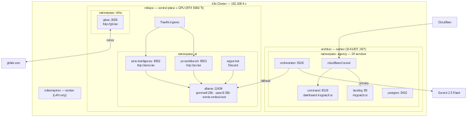

# homelab-infra

Infrastructure as Code for a 25-service AI agency homelab running on a single low-power server (Intel i3-4130T).

## Architecture



## Stack

- **OS:** Arch Linux (archbox)
- **Containers:** Rootless Podman with systemd quadlets
- **Networking:** Cloudflare Tunnel (no open ports)
- **LLM routing:** Gemini 2.5 Flash → Ollama (MikePC RTX 5060 Ti) → Groq fallback

## Structure

| Directory | Description |
|---|---|
| `quadlets/` | Systemd quadlet container units (Podman) |
| `nginx/` | Nginx reverse proxy configs |
| `scripts/` | Tunnel management, backup, and deploy scripts |
| `landing/` | RingCatch landing page |

## Services (25 containers in agency-pod)

| Service | Port | Purpose |
|---|---|---|
| agency-orchestrator | 8109 | AI brain  -  FastAPI, 22 tools |
| agency-outreach | 8080 | Email sending + booking chat |
| agency-scraper | 8079 | Google Maps lead scraper |
| agency-command | 8100 | Dashboard / command center |
| agency-discord | 8103 | Discord bot bridge |
| agency-billing | 8082 | Billing service |
| agency-landing | 8090 | Public landing page |

## Deployment

```bash
# Deploy quadlets
cp quadlets/* ~/.config/containers/systemd/
systemctl --user daemon-reload
systemctl --user start agency-pod

# Tunnel
bash scripts/tunnel-setup.sh
```

---

## k3s Cluster (Clinical AI Platform)

archbox joined a two-node **k3s cluster** on 2026-05-31 as the worker node for a separate clinical AI workload platform (distinct from the agency Podman pod).

### Cluster Topology

| Node | Role | LAN IP | Tailscale IP | Hardware |
|---|---|---|---|---|
| **mikepc** | Control plane + GPU | 192.168.4.54 | 100.97.45.57 | RTX 5060 Ti 16 GB |
| **archbox** | Worker | 192.168.4.46 | 100.96.122.27 | i3-4130T (this machine) |

### Workloads (ai namespace)

| Deployment | Image | Access | Pinned to |
|---|---|---|---|
| `ollama` | `ollama/ollama:latest` | `http://ollama:11434` (in-cluster) | mikepc (GPU) |
| `pv-workbench` | `registry.gitlab.com/molszewski423/pv-workbench:latest` | http://pv.lan | mikepc |
| `argus-bot` | `registry.gitlab.com/molszewski423/pv-workbench:latest` | Discord | mikepc |
| `ams-intelligence` | `registry.gitlab.com/molszewski423/ams-intelligence:latest` | http://ams.lan | mikepc |

All GPU workloads pinned to mikepc via `nodeSelector: kubernetes.io/hostname: mikepc`. archbox serves as capacity for future non-GPU workloads.

### Ingress

Traefik (k3s built-in) binds on both node Tailscale IPs. DNS via `/etc/hosts`:

```
# LAN access
192.168.4.54  pv.lan ams.lan

# Tailscale (remote)
100.97.45.57  pv.lan ams.lan
```

### Coexistence with Agency Pod

The k3s agent (containerd) and the Podman agency-pod run independently on archbox with no port conflicts. Agency services use ports 8079-8112; k3s uses the standard 6443/10250 range. The two stacks do not share container runtimes.

### LLM Routing (agency-pod to k3s Ollama)

The agency orchestrator routes to Ollama running inside k3s on mikepc:

```
OLLAMA_BASE_URL=http://100.97.45.57:11434   # ~/agency/.env
```

This replaces the previous direct `ollama.service` systemd unit on mikepc (stopped 2026-05-31).
